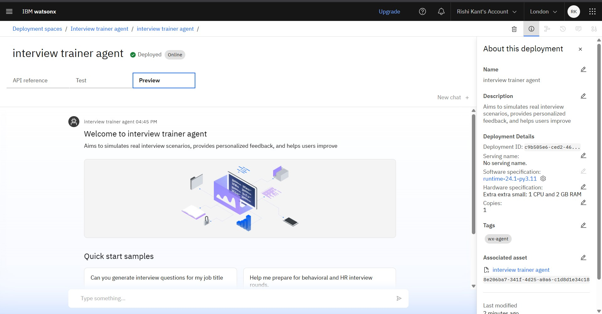

# 💼 Interview Trainer Agent (IBM watsonx.ai)

An intelligent AI-powered assistant built using IBM watsonx.ai that helps users prepare for job interviews through mock sessions, personalized question sets, and feedback. It supports both **technical** and **soft skill** interview simulations using Retrieval-Augmented Generation (RAG).

---

## 🚀 Features

- 🧠 AI-generated interview questions based on role, experience, and resume
- 🎯 Personalized strategies for job interviews
- 🧪 Soft skills + Technical question support
- 📄 Resume/job title input-based question tailoring
- 🗣️ HR and behavioral scenario simulations
- 🔁 Reusable, customizable conversation logic
- 🌐 Powered by IBM Foundation Models & watsonx.ai

---

## 🛠️ Tech Stack

- IBM Cloud (watsonx.ai)
- Retrieval-Augmented Generation (RAG)
- Git & GitHub for version control

---

## 🧭 How to Recreate This Agent

1. Sign in to [IBM watsonx.ai](https://dataplatform.cloud.ibm.com/)
2. Go to `Agent Builder` and create a new Agent
3. Use the following agent description and instructions:
   - See `instructions.txt` in this repo

---

## 🧪 Example Quick Start Questions

> These are the questions users can ask the agent:

- "Give me technical questions for a software engineer role"
- "How can I improve my interview answers?"
- "Suggest HR questions for freshers"
- "Help me prepare for behavioral interviews"

---

## 📸 Screenshots

Add screenshots of your IBM Agent setup here.

## 🤝 Contributing

Want to improve or suggest a feature? Feel free to fork the repo and submit a pull request.

---

## 📬 Contact

**Rishi Kant**  
📧 [0210rishi@gmail.com]  
🌐 [https://www.linkedin.com/in/rishi-kant-433b35287]
